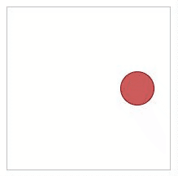
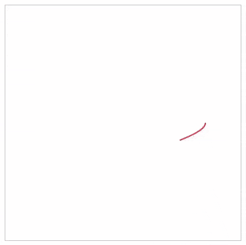

# Curvz - Animations along curves

This projects consists in building animations (translating DOM elements or drawing SVGs) along curves using parametric equations.

https://en.wikipedia.org/wiki/Parametric_equation

https://elepa.files.wordpress.com/2013/11/fifty-famous-curves.pdf

## Usage
Include the script on your page: `<script src="./src/curvz.js"></script>`

The whole API is using the namespace `CURVZ`

## Docs

### Create a curve
`CURVZ.curve(curveEq, options)`
- _curveEq_: see [Curve equations](#curve-equations)
- _options_ (Object):
  - _tStart_ - Starting point of the curve (By default 0)
  - _tEnd_ - Ending point of the curve (By default 1)
  - _x0_ - x coordinate of the (0, 0) point (By default 0)
  - _y0_ - y coordinate of the (0, 0) point (By default 0)
  - _x1_ - x coordinate of the (1, 1) point (By default 1)
  - _y1_ - y coordinate of the (1, 1) point (By default 1)

### Create an animation
**Generic method** `CURVZ.animate(updateFn, options)`
- _updateFn_: function with argument t doing whatever you want on each tick at time t
- _options_ (Object):
  - _duration_ - Duration of the animation in ms (By default 1000)
  - _tStart_ - Starting point of the animation on the curve (By default 0)
  - _tEnd_ - Ending point of the animation on the curve (By default 1)
  - _frameRate_ - Aimed frameRate. Throttle if faster. (By default 60)
  - _easing_ - see [Easing functions](#easing-functions) (By default CURVZ.LINEAR)
  
See demo files for examples of updateFn's.  

**Translating a DOM element along a curve** `CURVZ.translateAlongCurve(element, curveElt, options)`
- _element_: DOM element
- _curveElt_: Curve coming from a `CURVZ.curve(...)`
- _options_: Same as for `CURVZ.animate(...)`

**Drawing an SVG path along a curve** `CURVZ.drawCurve(path, curveElt, options)`
- _path_: path element inside an SVG
- _curveElt_: Curve coming from a `CURVZ.curve(...)`
- _options_: Same as for `CURVZ.animate(...)` plus
  - _nbPoints_ - Number of points used to draw the path (By default 1000)
  - _pointsOnly_ (boolean) - true to draw only points. false to draw lines between those points. (By default false)

### Curve equations
- `CURVZ.CIRCLE(options)` 
  - _r_: radius (By default 1)
- `CURVZ.ELLIPSIS(options)`
  - _a_: radius on the x-axis (By default 1)
  - _b_: radius on the y-axis (By default 1)
- `CURVZ.SPIRAL(options)`
  - _a_: number of loops (By default 1)
  - _r_: outer radius (By default 1)
- `CURVZ.FERMATSPIRAL(options)`
  - _a_: number of loops (By default 1)
  - _r_: outer radius (By default 1)
- `CURVZ.RHODONEA(options)`
  - _a_: if odd -> a petals, if even -> 2a petals (By default 2)
  - _r_: outer radius (By default 1)
- `CURVZ.LISSAJOUS(options)`
  - _a_: radius on the x-axis (By default 1)
  - _b_: radius on the y-axis (By default 1)
  - _kx_: number of horizontal lobes (By default 1)
  - _ky_: number of vertical lobes (By default 1)
- `CURVZ.HYPOTROCHOID(options)`
  - _R_: radius of the outer circle (By default 1)
  - _r_: radius of the inner circle (By default 0.6)
  - _d_: distance between the pen and the center of the inner circle (By default 1)

You can create a custom curve equation. If needs to be in the following format:
```
function myCurveEq([options]) {
  return {
    start: ... // Starting t for this curve
    end: ... // Ending t for this curve
    getXY: function(t) {
      return {
        x: ..., // equation depending on t and the potential options for the x coordinate
        y: ...  // equation depending on t and the potential options for the y coordinate
      }
    }
  };
}
```
  
### Easing functions
See http://cdnjs.cloudflare.com/ajax/libs/jquery-easing/1.3/jquery.easing.js
- `CURVZ.LINEAR`: Linear easing function
- `CURVZ.EASEIN`, `CURVZ.EASEOUT` and `CURVZ.EASEINOUT`: Sine easing functions
- `CURVZ.EASEINQUART`, `CURVZ.EASEOUTQUART` and `CURVZ.EASEINOUTQUART`: Quartic easing functions
- `CURVZ.BOUNCEIN`, `CURVZ.BOUNCEOUT` and `CURVZ.BOUNCEINOUT`: Bouncing easing functions
- `CURVZ.EASEINELASTIC`, `CURVZ.EASEOUTELASTIC` and `CURVZ.EASEINOUTELASTIC`: Elastic easing functions

You can create a custom easing function. If needs to be in the following format:
```
function myEasingFunction(t) {
  return ...; // Something depending on t varying between 0 and 1
}
```

## Examples

### Translating a div along an ellipsis (see demo/translate_example.html)

```
<div style="position: relative; display: inline-block; width: 200px; height: 200px; border: 1px solid #c1c1c1;">

  <div id="myDiv"
       style="position: absolute; left: 0; top: 0; width: 40px; height: 40px; border: 1px solid darkred; background-color: indianred; border-radius: 50%;">
  </div>

</div>
```

```
  var myCurve = CURVZ.curve(
    CURVZ.ELLIPSIS({ a: 1.2, b: 0.7 }),
    { x0: 100, y0: 100, x1: 150, y1: 150}
  );

  var myDiv = document.getElementById("myDiv");

  CURVZ.translateAlongCurve(myDiv, myCurve,
    {
      duration: 2000,
      easing: CURVZ.BOUNCEOUT
    }
  );
```



### Drawing a star as an SVG path (see demo/draw_example.html)

```
<svg viewBox="0 0 400 400"
     width="400"
     height="400"
     style="border: solid 1px #c1c1c1;">
  <path id="myPath"
        stroke="#EF233C"
        stroke-width="2"
        fill="none"
        d=""></path>
</svg>
```


```
  var myCurve = CURVZ.curve(
    CURVZ.HYPOTROCHOID({ R: 1, r: 0.6, d: 1 }),
    { x0: 200, y0: 200, x1: 300, y1: 300}
  );

  var myPath = document.getElementById("myPath");

  CURVZ.drawCurve(myPath, myCurve,
    {
      duration: 3000,
      easing: CURVZ.EASEINOUT,
      nbPoints: 10000
    }
  );
```


